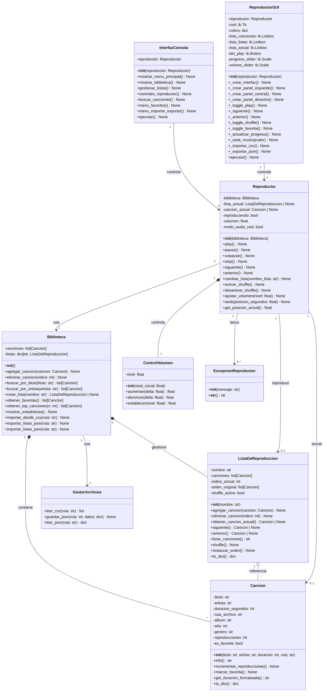

# 🎵 Reproductor de Música - POO

## 📋 Tabla de Contenidos

- [Descripción](#-descripción)
- [Características](#-características)
- [Diagrama de Clases](#-diagrama-de-clases)
- [Requisitos Funcionales](#-requisitos-funcionales)

---

## 📖 Descripción

Reproductor de música interactivo que permite a los usuarios gestionar sus gustos musicales, crear listas de reproducción personalizadas, y controlar la reproducción con una interfaz de consola.

### Problemática

Los usuarios necesitan una herramienta que les permita:
- 📚 Organizar colecciones de música
- 🎵 Crear listas de reproducción 
- ⚡ Acceder rápidamente a sus canciones
- 🔍 Buscar canciones por título o artista
- 📊 Obtener estadísticas de reproducción

### Solución

Sistema de gestión musical con arquitectura orientada a objetos:
- ✅ Gestión de la biblioteca
- ✅ Listas de reproducción ilimitadas
- ✅ Navegación entre canciones
- ✅ Controles de reproducción completos

---

## ✨ Características

### Implementadas

#### 📚 Gestión de Biblioteca
- Agregar canciones con (título, artista, álbum, año, género)
- Eliminar canciones del catálogo
- Listar todas las canciones con formato legible

#### 🎵 Listas de Reproducción
- Crear múltiples listas personalizadas
- Agregar/eliminar canciones de listas
- Ver contenido detallado de cada lista
- Cálculo automático de duración total

#### ▶ Controles de Reproducción
- *Play*: Inicia o reanuda reproducción
- *Pause*: Pausa la canción actual
- *Siguiente*: Avanza (navegación circular)
- *Anterior*: Retrocede (navegación circular)

#### 🔍 Búsqueda Inteligente
- Búsqueda por título 
- Búsqueda por artista 

#### 📊 Estadísticas
- Total de canciones en biblioteca
- Total de listas creadas
- Duración acumulada de toda la música
- Información detallada por canción

#### 🔀 Modo Aleatorio
- Reproducción aleatoria de canciones

#### ⭐ Sistema de Favoritos
- Marcar canciones favoritas
- Ver estadísticas de reproducción

#### 📥 Importar/Exportar
- Importar canciones desde CSV
- Exportar/importar listas en JSON

#### 🎧 Reproducción Real
- Reproducción de archivos MP3/WAV

---

## 🎵 Diagrama de Clases

### Descripción de Clases

#### 🎼 Cancion
Representa una canción individual con todos sus metadatos.
- *Responsabilidad*: Almacenar y gestionar información de una canción
- *Métodos principales*: info(), incrementar_reproducciones(), get_duracion_formateada()

#### 📋 ListaDeReproduccion
Gestiona una colección ordenada de canciones.
- *Responsabilidad*: Mantener lista de canciones y controlar navegación
- *Métodos principales*: siguiente(), anterior(), agregar_cancion(), eliminar_cancion()

#### 📚 Biblioteca
Catálogo central de toda la música y listas.
- *Responsabilidad*: Gestionar todas las canciones y listas de reproducción
- *Métodos principales*: crear_lista(), buscar_por_titulo(), buscar_por_artista()

#### 🎮 Reproductor
Controlador principal de reproducción.
- *Responsabilidad*: Gestionar estado de reproducción y controles
- *Métodos principales*: play(), pause(), stop(), siguiente(), anterior()

#### 💻 InterfazConsola
Interfaz de usuario en modo consola.
- *Responsabilidad*: Interacción con el usuario mediante menús
- *Métodos principales*: ejecutar(), mostrar_menu_principal(), gestionar_listas()

---

## 📋 Requisitos Funcionales

### ✅ Todos los Requisitos Completados

#### RF1: Gestionar Biblioteca Musical
- *Descripción*: Agregar, eliminar y listar canciones
- *Archivos*: biblioteca.py, cancion.py
- *Estado*: ✅ Completado

#### RF2: Reproducir Canción Actual
- *Descripción*: Simular reproducción con controles play/pause/stop
- *Archivos*: reproductor.py, cancion.py
- *Estado*: ✅ Completado

#### RF3: Navegar entre Canciones
- *Descripción*: Siguiente/Anterior con navegación circular
- *Archivos*: reproductor.py, lista_reproduccion.py
- *Estado*: ✅ Completado

#### RF4: Gestionar Listas de Reproducción
- *Descripción*: Crear, eliminar y modificar listas
- *Archivos*: biblioteca.py, lista_reproduccion.py
- *Estado*: ✅ Completado

#### RF5: Mostrar Información Detallada
- *Descripción*: Información completa de canciones
- *Archivos*: cancion.py, interfaz.py
- *Estado*: ✅ Completado

#### RF6: Modo Aleatorio
- *Descripción*: Reproducción aleatoria de canciones
- *Librería*: random
- *Estado*: ✅ Completado

#### RF7: Sistema de Favoritos y Estadísticas
- *Descripción*: Marcar canciones favoritas
- *Estado*: ✅ Completado

#### RF8: Importar desde CSV
- *Descripción*: Carga masiva de canciones
- *Librería*: csv
- *Estado*: ✅ Completado

#### RF9: Exportar a JSON
- *Descripción*: Persistencia de listas
- *Librería*: json
- *Estado*: ✅ Completado

#### RF10: Reproducción Real de Audio
- *Descripción*: Reproducción de archivos MP3/WAV
- *Librería*: pygame
- *Estado*: ✅ Completado