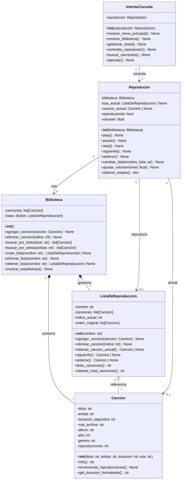

# 🎵 Reproductor de Música - POO

## 📋 Tabla de Contenidos

- [Descripción](#-descripción)
- [Características](#-características)
- [Diagrama de Clases](#-diagrama-de-clases)
- [Estructura del Proyecto](#-estructura-del-proyecto)
- [Instalación](#-instalación)
- [Uso](#-uso)
- [Requisitos Funcionales](#-requisitos-funcionales)
- [Arquitectura](#-arquitectura)
- [Ejemplos](#-ejemplos)
- [Equipo](#-equipo)
- [Roadmap](#-roadmap)
- [Licencia](#-licencia)

---

## 📖 Descripción

Reproductor de música interactivo que permite a los usuarios gestionar sus gustos musicales, crear listas de reproducción personalizadas, y controlar la reproducción con una interfaz de consola.

### Problemática

Los usuarios necesitan una herramienta que les permita:
- 📚 Organizar colecciones de música
- 🎵 Crear listas de reproducción 
- ⚡ Acceder rápidamente a sus canciones
- 🔍 Buscar canciones por título o artista
- 📊 Obtener estadísticas de reproducción

### Solución

Sistema de gestión musical con arquitectura orientada a objetos:
- ✅ Gestión de la biblioteca
- ✅ Listas de reproducción ilimitadas
- ✅ Navegación entre canciones
- ✅ Búsqueda 
- ✅ Controles de reproducción completos

---

## ✨ Características

### Implementadas en MVP 

#### 📚 Gestión de Biblioteca
- Agregar canciones con (título, artista, álbum, año, género)
- Eliminar canciones del catálogo
- Listar todas las canciones con formato legible

#### 🎵 Listas de Reproducción
- Crear múltiples listas personalizadas
- Agregar/eliminar canciones de listas
- Ver contenido detallado de cada lista
- Cálculo automático de duración total

#### ▶️ Controles de Reproducción
- **Play**: Inicia o reanuda reproducción
- **Pause**: Pausa la canción actual
- **Siguiente**: Avanza (navegación circular)
- **Anterior**: Retrocede (navegación circular)

#### 🔍 Búsqueda Inteligente
- Búsqueda por título 
- Búsqueda por artista 

#### 📊 Estadísticas
- Total de canciones en biblioteca
- Total de listas creadas
- Duración acumulada de toda la música
- Información detallada por canción

---

## 🏗️ Diagrama de Clases



### Descripción de Clases

#### 🎼 Cancion
Representa una canción individual con todos sus metadatos.
- **Responsabilidad**: Almacenar y gestionar información de una canción
- **Métodos principales**: `info()`, `incrementar_reproducciones()`, `get_duracion_formateada()`

#### 📋 ListaDeReproduccion
Gestiona una colección ordenada de canciones.
- **Responsabilidad**: Mantener lista de canciones y controlar navegación
- **Métodos principales**: `siguiente()`, `anterior()`, `agregar_cancion()`, `eliminar_cancion()`

#### 📚 Biblioteca
Catálogo central de toda la música y listas.
- **Responsabilidad**: Gestionar todas las canciones y listas de reproducción
- **Métodos principales**: `crear_lista()`, `buscar_por_titulo()`, `buscar_por_artista()`

#### 🎮 Reproductor
Controlador principal de reproducción.
- **Responsabilidad**: Gestionar estado de reproducción y controles
- **Métodos principales**: `play()`, `pause()`, `stop()`, `siguiente()`, `anterior()`

#### 💻 InterfazConsola
Interfaz de usuario en modo consola.
- **Responsabilidad**: Interacción con el usuario mediante menús
- **Métodos principales**: `ejecutar()`, `mostrar_menu_principal()`, `gestionar_listas()`

---

## 📁 Estructura del Proyecto

```
reproductor-musica-poo/
│
├── cancion.py              # Clase Cancion
├── lista_reproduccion.py   # Clase ListaDeReproduccion
├── biblioteca.py           # Clase Biblioteca
├── reproductor.py          # Clase Reproductor
├── interfaz.py             # Clase InterfazConsola
├── main.py                 # Punto de entrada
│
├── README.md               # Este archivo
├── .gitignore              # Archivos ignorados por Git
│
├── docs/
│   └── analisis.md         # Documento de análisis completo
│
├── data/
│   └── .gitkeep
│
└── music/
    └── .gitkeep
```

### Descripción de Archivos

| Archivo | Descripción |
|---------|-------------|
| `cancion.py` | Define la clase Cancion con metadatos |
| `lista_reproduccion.py` | Gestión de listas y navegación |
| `biblioteca.py` | Catálogo central de música |
| `reproductor.py` | Controles de reproducción |
| `interfaz.py` | Interfaz de usuario en consola |
| `main.py` | Inicialización y datos demo |

---

## 🚀 Instalación

### Requisitos Previos

- Python 3.9 o superior
- Git (opcional, para clonar el repositorio)

### Instalación Local

```bash
# Clonar el repositorio
git clone https://github.com/TU-USUARIO/reproductor-musica-poo.git
cd reproductor-musica-poo

# No requiere instalación de dependencias externas
# Usa solo librerías estándar de Python
```

---

## 💻 Uso

### Ejecutar el Programa

```bash
python main.py
```

O si tienes Python 3 explícitamente:

```bash
python3 main.py
```

### Menú Principal

Al ejecutar verás:

```
============================================================
                    ♪ REPRODUCTOR DE MÚSICA ♪
============================================================
1. Ver Biblioteca
2. Gestionar Listas de Reproducción
3. Controles del Reproductor
4. Buscar Canciones
5. Estadísticas
0. Salir
============================================================
```

### Flujo de Uso Típico

#### 1️⃣ Ver la Biblioteca
```
Opción: 1

============================================================
                     BIBLIOTECA MUSICAL
============================================================
1. Bohemian Rhapsody - Queen (5:55)
2. Imagine - John Lennon (3:03)
3. Stairway to Heaven - Led Zeppelin (8:02)
4. Hotel California - Eagles (6:31)
5. Billie Jean - Michael Jackson (4:54)
6. Smells Like Teen Spirit - Nirvana (5:01)
============================================================
Total: 6 canciones
```

#### 2️⃣ Gestionar Listas
```
--- GESTIÓN DE LISTAS ---
1. Ver todas las listas
2. Crear nueva lista
3. Ver contenido de una lista
4. Agregar canción a lista
5. Eliminar canción de lista
6. Eliminar lista
0. Volver
```

#### 3️⃣ Controles del Reproductor
```
--- CONTROLES DEL REPRODUCTOR ---

🎵 Canción: Bohemian Rhapsody - Queen (5:55)
📋 Lista: Rock Clásico
▶ Estado: Pausado
🔊 Volumen: 70%

1. Play
2. Pause
3. Stop
4. Siguiente
5. Anterior
6. Cambiar lista activa
7. Ajustar volumen
8. Info de canción actual
0. Volver
```

---

## 📋 Requisitos Funcionales

### ✅ Implementados (MVP v1.0)

#### RF1: Gestionar Biblioteca Musical
- **Descripción**: Agregar, eliminar y listar canciones
- **Archivos**: `biblioteca.py`, `cancion.py`
- **Estado**: ✅ Completado

#### RF2: Reproducir Canción Actual
- **Descripción**: Simular reproducción con controles play/pause/stop
- **Archivos**: `reproductor.py`, `cancion.py`
- **Estado**: ✅ Completado

#### RF3: Navegar entre Canciones
- **Descripción**: Siguiente/Anterior con navegación circular
- **Archivos**: `reproductor.py`, `lista_reproduccion.py`
- **Estado**: ✅ Completado

#### RF4: Gestionar Listas de Reproducción
- **Descripción**: Crear, eliminar y modificar listas
- **Archivos**: `biblioteca.py`, `lista_reproduccion.py`
- **Estado**: ✅ Completado

#### RF5: Mostrar Información Detallada
- **Descripción**: Información completa de canciones
- **Archivos**: `cancion.py`, `interfaz.py`
- **Estado**: ✅ Completado

### 🔜 Planificados (Entrega final)

#### RF6: Modo Aleatorio
- Reproducción aleatoria de canciones
- Librería: `random`

#### RF7: Sistema de Favoritos y Estadísticas
- Marcar canciones favoritas
- Top 10 más reproducidas

#### RF8: Importar desde CSV
- Carga masiva de canciones
- Librería: `csv`

#### RF9: Exportar a JSON
- Persistencia de listas
- Librería: `json`

#### RF10: Reproducción Real de Audio
- Reproducción de archivos MP3/WAV
- Librería: `pygame`

---

## 🏛️ Arquitectura

### Principios de Diseño

#### Programación Orientada a Objetos
- ✅ **Encapsulamiento**: Cada clase protege sus datos internos
- ✅ **Abstracción**: Interfaces claras y métodos bien definidos
- ✅ **Composición**: Biblioteca compone Canciones y Listas


#### Separación de Capas
```
┌─────────────────────────────────┐
│     Capa de Presentación        │
│      (InterfazConsola)          │
└────────────┬────────────────────┘
             │
┌────────────▼────────────────────┐
│     Capa de Lógica de Negocio   │
│  (Reproductor, Biblioteca)      │
└────────────┬────────────────────┘
             │
┌────────────▼────────────────────┐
│      Capa de Datos              │
│  (Cancion, ListaDeReproduccion) │
└─────────────────────────────────┘
```

#### Flujo de Dependencias
```
main.py
  └─> interfaz.py
       └─> reproductor.py
            └─> biblioteca.py
                 ├─> cancion.py
                 └─> lista_reproduccion.py
                      └─> cancion.py
```

---

## 💡 Ejemplos

### Crear y Usar una Biblioteca

```python
from cancion import Cancion
from biblioteca import Biblioteca

# Crear biblioteca
biblioteca = Biblioteca()

# Agregar canciones
cancion1 = Cancion("Bohemian Rhapsody", "Queen", 355, "song.mp3")
biblioteca.agregar_cancion(cancion1)

# Crear lista
lista = biblioteca.crear_lista("Favoritos")
lista.agregar_cancion(cancion1)

# Buscar
resultados = biblioteca.buscar_por_artista("Queen")
print(f"Encontradas: {len(resultados)} canciones")
```

### Usar el Reproductor

```python
from reproductor import Reproductor

# Crear reproductor
reproductor = Reproductor(biblioteca)

# Cambiar lista activa
reproductor.cambiar_lista("Favoritos")

# Reproducir
reproductor.play()  # ▶ REPRODUCIENDO: Bohemian Rhapsody...

# Navegar
reproductor.siguiente()  # ⏭ Siguiente: ...
reproductor.anterior()   # ⏮ Anterior: ...

# Controlar
reproductor.pause()      # ⏸ Pausado
reproductor.stop()       # ⏹ Detenido
```

---

## 👥 Equipo

### Integrantes

| Nombre                  | Rol | 
|-------------------------|-----|
| **Juan Esteban Correa** | Desarrollador | 
| **Juan Pablo Gaviria**  | Desarrollador |


---

## 🗺️ Roadmap

### Versión 1.0 (Actual) ✅
- [x] Gestión básica de biblioteca
- [x] Listas de reproducción
- [x] Controles de reproducción (simulados)
- [x] Búsqueda por título/artista
- [x] Estadísticas básicas
- [x] Interfaz de consola completa

### Versión 2.0 (Próxima) 🚧
- [ ] Modo shuffle aleatorio
- [ ] Sistema de favoritos
- [ ] Importación desde CSV
- [ ] Exportación a JSON
- [ ] Reproducción real con pygame

### Versión 3.0 (Futuro) 🔮
- [ ] Interfaz gráfica (tkinter/PyQt)
- [ ] Base de datos SQLite
- [ ] Integración con APIs musicales

---

## 📄 Licencia

Este proyecto está bajo la Licencia MIT.

---

## 🎓 Contexto Académico

- **Institución**: Universidad de Medellín
- **Curso**: Programación Orientada a Objetos
- **Semestre**: 2025 - 2
- **Profesor**: Mario Saldarriaga

---


---

<div align="center">

**Desarrollado con ❤️ usando Python y POO**

⭐ Si este proyecto te fue útil, considera darle una estrella en GitHub

[⬆ Volver arriba](#-reproductor-de-música---poo)

</div>