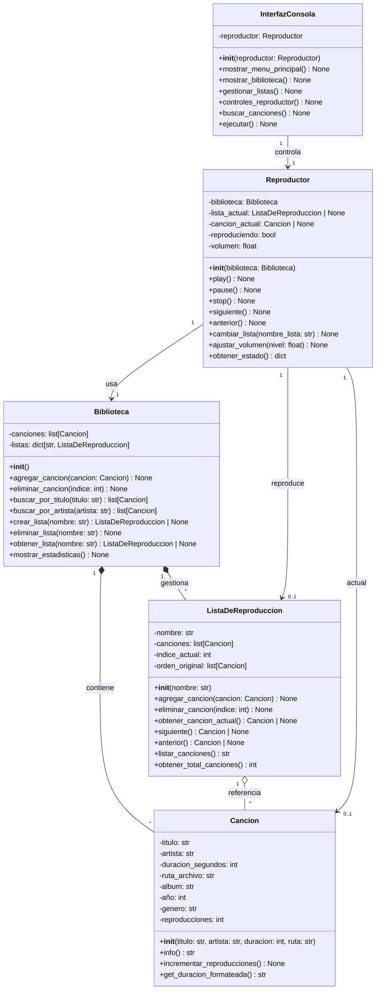

# 🎵 Reproductor de Música - POO

> Sistema de gestión y reproducción de música desarrollado en Python con Programación Orientada a Objetos


---

## 📋 Tabla de Contenidos

- [Descripción](#-descripción)
- [Características](#-características)
- [Diagrama de Clases](#-diagrama-de-clases)
- [Estructura del Proyecto](#-estructura-del-proyecto)
- [Instalación](#-instalación)
- [Uso](#-uso)
- [Requisitos Funcionales](#-requisitos-funcionales)
- [Arquitectura](#-arquitectura)
- [Ejemplos](#-ejemplos)
- [Equipo](#-equipo)
- [Roadmap](#-roadmap)
- [Licencia](#-licencia)

---

## 📖 Descripción

Reproductor de música interactivo que permite a los usuarios gestionar su biblioteca musical, crear listas de reproducción personalizadas, y controlar la reproducción con una interfaz de consola intuitiva.

### Problemática

Los usuarios necesitan una herramienta que les permita:
- 📚 Organizar grandes colecciones de música
- 🎵 Crear listas de reproducción temáticas
- ⚡ Acceder rápidamente a sus canciones
- 🔍 Buscar canciones por título o artista
- 📊 Obtener estadísticas de reproducción

### Solución

Sistema de gestión musical con arquitectura orientada a objetos:
- ✅ Gestión centralizada de biblioteca
- ✅ Listas de reproducción ilimitadas
- ✅ Navegación circular entre canciones
- ✅ Búsqueda inteligente
- ✅ Controles de reproducción completos

---

## ✨ Características

### Implementadas en MVP v1.0

#### 📚 Gestión de Biblioteca
- Agregar canciones con metadatos completos (título, artista, álbum, año, género)
- Eliminar canciones del catálogo
- Listar todas las canciones con formato legible
- Contador automático de reproducciones

#### 🎵 Listas de Reproducción
- Crear múltiples listas personalizadas
- Agregar/eliminar canciones de listas
- Ver contenido detallado de cada lista
- Cálculo automático de duración total

#### ▶️ Controles de Reproducción
- **Play**: Inicia o reanuda reproducción
- **Pause**: Pausa la canción actual
- **Stop**: Detiene completamente
- **Siguiente**: Avanza (navegación circular)
- **Anterior**: Retrocede (navegación circular)
- **Volumen**: Ajuste de 0% a 100%

#### 🔍 Búsqueda Inteligente
- Búsqueda por título (case-insensitive)
- Búsqueda por artista (case-insensitive)
- Búsqueda parcial de términos
- Resultados formateados

#### 📊 Estadísticas
- Total de canciones en biblioteca
- Total de listas creadas
- Duración acumulada de toda la música
- Contador total de reproducciones
- Información detallada por canción

---

## 🏗️ Diagrama de Clases



### Descripción de Clases

#### 🎼 Cancion
Representa una canción individual con todos sus metadatos.
- **Responsabilidad**: Almacenar y gestionar información de una canción
- **Métodos principales**: `info()`, `incrementar_reproducciones()`, `get_duracion_formateada()`

#### 📋 ListaDeReproduccion
Gestiona una colección ordenada de canciones.
- **Responsabilidad**: Mantener lista de canciones y controlar navegación
- **Métodos principales**: `siguiente()`, `anterior()`, `agregar_cancion()`, `eliminar_cancion()`

#### 📚 Biblioteca
Catálogo central de toda la música y listas.
- **Responsabilidad**: Gestionar todas las canciones y listas de reproducción
- **Métodos principales**: `crear_lista()`, `buscar_por_titulo()`, `buscar_por_artista()`

#### 🎮 Reproductor
Controlador principal de reproducción.
- **Responsabilidad**: Gestionar estado de reproducción y controles
- **Métodos principales**: `play()`, `pause()`, `stop()`, `siguiente()`, `anterior()`

#### 💻 InterfazConsola
Interfaz de usuario en modo consola.
- **Responsabilidad**: Interacción con el usuario mediante menús
- **Métodos principales**: `ejecutar()`, `mostrar_menu_principal()`, `gestionar_listas()`

---

## 📁 Estructura del Proyecto

```
reproductor-musica-poo/
│
├── cancion.py              # Clase Cancion
├── lista_reproduccion.py   # Clase ListaDeReproduccion
├── biblioteca.py           # Clase Biblioteca
├── reproductor.py          # Clase Reproductor
├── interfaz.py             # Clase InterfazConsola
├── main.py                 # Punto de entrada
│
├── README.md               # Este archivo
├── .gitignore              # Archivos ignorados por Git
│
├── docs/
│   └── analisis.md         # Documento de análisis completo
│
├── data/
│   └── .gitkeep
│
└── music/
    └── .gitkeep
```

### Descripción de Archivos

| Archivo | Descripción | Líneas |
|---------|-------------|--------|
| `cancion.py` | Define la clase Cancion con metadatos | ~80 |
| `lista_reproduccion.py` | Gestión de listas y navegación | ~120 |
| `biblioteca.py` | Catálogo central de música | ~90 |
| `reproductor.py` | Controles de reproducción | ~100 |
| `interfaz.py` | Interfaz de usuario en consola | ~200 |
| `main.py` | Inicialización y datos demo | ~70 |

---

## 🚀 Instalación

### Requisitos Previos

- Python 3.9 o superior
- Git (opcional, para clonar el repositorio)

### Instalación Local

```bash
# Clonar el repositorio
git clone https://github.com/TU-USUARIO/reproductor-musica-poo.git
cd reproductor-musica-poo

# No requiere instalación de dependencias externas
# Usa solo librerías estándar de Python
```

### Estructura de Directorios

```bash
# Crear carpetas necesarias
mkdir docs data music
touch music/.gitkeep
```

---

## 💻 Uso

### Ejecutar el Programa

```bash
python main.py
```

O si tienes Python 3 explícitamente:

```bash
python3 main.py
```

### Menú Principal

Al ejecutar verás:

```
============================================================
                    ♪ REPRODUCTOR DE MÚSICA ♪
============================================================
1. Ver Biblioteca
2. Gestionar Listas de Reproducción
3. Controles del Reproductor
4. Buscar Canciones
5. Estadísticas
0. Salir
============================================================
```

### Flujo de Uso Típico

#### 1️⃣ Ver la Biblioteca
```
Opción: 1

============================================================
                     BIBLIOTECA MUSICAL
============================================================
1. Bohemian Rhapsody - Queen (5:55)
2. Imagine - John Lennon (3:03)
3. Stairway to Heaven - Led Zeppelin (8:02)
4. Hotel California - Eagles (6:31)
5. Billie Jean - Michael Jackson (4:54)
6. Smells Like Teen Spirit - Nirvana (5:01)
============================================================
Total: 6 canciones
```

#### 2️⃣ Gestionar Listas
```
--- GESTIÓN DE LISTAS ---
1. Ver todas las listas
2. Crear nueva lista
3. Ver contenido de una lista
4. Agregar canción a lista
5. Eliminar canción de lista
6. Eliminar lista
0. Volver
```

#### 3️⃣ Controles del Reproductor
```
--- CONTROLES DEL REPRODUCTOR ---

🎵 Canción: Bohemian Rhapsody - Queen (5:55)
📋 Lista: Rock Clásico
▶ Estado: Pausado
🔊 Volumen: 70%

1. Play
2. Pause
3. Stop
4. Siguiente
5. Anterior
6. Cambiar lista activa
7. Ajustar volumen
8. Info de canción actual
0. Volver
```

#### 4️⃣ Buscar Canciones
```
--- BUSCAR CANCIONES ---
1. Buscar por título
2. Buscar por artista

Opción: 2
Artista: queen

============================================================
  Encontradas 1 canciones
============================================================
1. Bohemian Rhapsody - Queen (5:55)
============================================================
```

#### 5️⃣ Ver Estadísticas
```
=== ESTADÍSTICAS DE LA BIBLIOTECA ===
Total de canciones: 6
Total de listas: 2
Duración total: 0h 38m
Reproducciones totales: 35
```

---

## 📋 Requisitos Funcionales

### ✅ Implementados (MVP v1.0)

#### RF1: Gestionar Biblioteca Musical
- **Descripción**: Agregar, eliminar y listar canciones
- **Archivos**: `biblioteca.py`, `cancion.py`
- **Estado**: ✅ Completado

#### RF2: Reproducir Canción Actual
- **Descripción**: Simular reproducción con controles play/pause/stop
- **Archivos**: `reproductor.py`, `cancion.py`
- **Estado**: ✅ Completado

#### RF3: Navegar entre Canciones
- **Descripción**: Siguiente/Anterior con navegación circular
- **Archivos**: `reproductor.py`, `lista_reproduccion.py`
- **Estado**: ✅ Completado

#### RF4: Gestionar Listas de Reproducción
- **Descripción**: Crear, eliminar y modificar listas
- **Archivos**: `biblioteca.py`, `lista_reproduccion.py`
- **Estado**: ✅ Completado

#### RF5: Mostrar Información Detallada
- **Descripción**: Información completa de canciones
- **Archivos**: `cancion.py`, `interfaz.py`
- **Estado**: ✅ Completado

### 🔜 Planificados (v2.0)

#### RF6: Modo Shuffle
- Reproducción aleatoria de canciones
- Librería: `random`

#### RF7: Sistema de Favoritos y Estadísticas
- Marcar canciones favoritas
- Top 10 más reproducidas

#### RF8: Importar desde CSV
- Carga masiva de canciones
- Librería: `csv`

#### RF9: Exportar a JSON
- Persistencia de listas
- Librería: `json`

#### RF10: Reproducción Real de Audio
- Reproducción de archivos MP3/WAV
- Librería: `pygame`

---

## 🏛️ Arquitectura

### Principios de Diseño

#### Programación Orientada a Objetos
- ✅ **Encapsulamiento**: Cada clase protege sus datos internos
- ✅ **Abstracción**: Interfaces claras y métodos bien definidos
- ✅ **Composición**: Biblioteca compone Canciones y Listas
- ✅ **Single Responsibility**: Cada clase tiene una responsabilidad única

#### Separación de Capas
```
┌─────────────────────────────────┐
│     Capa de Presentación        │
│      (InterfazConsola)          │
└────────────┬────────────────────┘
             │
┌────────────▼────────────────────┐
│     Capa de Lógica de Negocio   │
│  (Reproductor, Biblioteca)      │
└────────────┬────────────────────┘
             │
┌────────────▼────────────────────┐
│      Capa de Datos              │
│  (Cancion, ListaDeReproduccion) │
└─────────────────────────────────┘
```

#### Flujo de Dependencias
```
main.py
  └─> interfaz.py
       └─> reproductor.py
            └─> biblioteca.py
                 ├─> cancion.py
                 └─> lista_reproduccion.py
                      └─> cancion.py
```

### Patrones de Diseño Utilizados

#### 1. Composición sobre Herencia
```python
# Biblioteca TIENE canciones (no ES una canción)
class Biblioteca:
    def __init__(self):
        self.canciones: list[Cancion] = []
```

#### 2. Navegación Circular
```python
# Avanza y vuelve al inicio automáticamente
def siguiente(self):
    self.indice_actual = (self.indice_actual + 1) % len(self.canciones)
```

#### 3. Estado del Sistema
```python
# Reproductor mantiene estado centralizado
def obtener_estado(self) -> dict:
    return {
        "cancion": str(self.cancion_actual),
        "lista": self.lista_actual.nombre,
        "reproduciendo": self.reproduciendo
    }
```

---

## 💡 Ejemplos

### Crear y Usar una Biblioteca

```python
from cancion import Cancion
from biblioteca import Biblioteca

# Crear biblioteca
biblioteca = Biblioteca()

# Agregar canciones
cancion1 = Cancion("Bohemian Rhapsody", "Queen", 355, "song.mp3")
biblioteca.agregar_cancion(cancion1)

# Crear lista
lista = biblioteca.crear_lista("Favoritos")
lista.agregar_cancion(cancion1)

# Buscar
resultados = biblioteca.buscar_por_artista("Queen")
print(f"Encontradas: {len(resultados)} canciones")
```

### Usar el Reproductor

```python
from reproductor import Reproductor

# Crear reproductor
reproductor = Reproductor(biblioteca)

# Cambiar lista activa
reproductor.cambiar_lista("Favoritos")

# Reproducir
reproductor.play()  # ▶ REPRODUCIENDO: Bohemian Rhapsody...

# Navegar
reproductor.siguiente()  # ⏭ Siguiente: ...
reproductor.anterior()   # ⏮ Anterior: ...

# Controlar
reproductor.pause()      # ⏸ Pausado
reproductor.stop()       # ⏹ Detenido
```

### Gestionar Listas

```python
# Crear lista
lista_rock = biblioteca.crear_lista("Rock Clásico")

# Agregar múltiples canciones
for cancion in [cancion1, cancion2, cancion3]:
    lista_rock.agregar_cancion(cancion)

# Ver contenido
print(lista_rock.listar_canciones())

# Navegación
lista_rock.siguiente()  # Avanza
lista_rock.anterior()   # Retrocede
```

---

## 👥 Equipo

### Integrantes

| Nombre | Rol | Responsabilidad |
|--------|-----|-----------------|
| **[Nombre 1]** | Desarrollador | Cancion + Biblioteca (canciones) |
| **[Nombre 2]** | Desarrollador | ListaDeReproduccion + Navegación |
| **[Nombre 3]** | Desarrollador | Reproductor + Controles |
| **[Nombre 4]** | Desarrollador | InterfazConsola + Main |

### Distribución de Trabajo

#### Integrante 1: Módulo de Canciones
- ✅ `cancion.py` completo
- ✅ Métodos de gestión en `biblioteca.py`
- ✅ Búsquedas por título y artista

#### Integrante 2: Módulo de Listas
- ✅ `lista_reproduccion.py` completo
- ✅ Navegación circular
- ✅ Cálculos de duración

#### Integrante 3: Módulo de Reproducción
- ✅ `reproductor.py` completo
- ✅ Controles play/pause/stop
- ✅ Integración con listas

#### Integrante 4: Interfaz y Main
- ✅ `interfaz.py` completo
- ✅ `main.py` con datos demo
- ✅ Menús interactivos

---

## 🗺️ Roadmap

### Versión 1.0 (Actual) ✅
- [x] Gestión básica de biblioteca
- [x] Listas de reproducción
- [x] Controles de reproducción (simulados)
- [x] Búsqueda por título/artista
- [x] Estadísticas básicas
- [x] Interfaz de consola completa

### Versión 2.0 (Próxima) 🚧
- [ ] Modo shuffle aleatorio
- [ ] Sistema de favoritos
- [ ] Importación desde CSV
- [ ] Exportación a JSON
- [ ] Reproducción real con pygame
- [ ] Ecualizador de audio

### Versión 3.0 (Futuro) 🔮
- [ ] Interfaz gráfica (tkinter/PyQt)
- [ ] Base de datos SQLite
- [ ] Integración con APIs musicales
- [ ] Letras sincronizadas
- [ ] Visualizador de espectro
- [ ] Compartir listas en línea

---

## 🧪 Testing

### Casos de Prueba Implementados

#### Test 1: Navegación Circular
```python
# Lista con 4 canciones
lista.indice_actual = 3  # Última posición
lista.siguiente()        # Debe volver a 0
assert lista.indice_actual == 0  # ✅ Pasa
```

#### Test 2: Contador de Reproducciones
```python
cancion.reproducciones = 0
reproductor.play()  # Primera reproducción
assert cancion.reproducciones == 1  # ✅ Pasa
```

#### Test 3: Búsqueda Case-Insensitive
```python
resultados = biblioteca.buscar_por_titulo("BOHEMIAN")
assert len(resultados) > 0  # ✅ Encuentra "Bohemian Rhapsody"
```

#### Test 4: Manejo de Lista Vacía
```python
lista_vacia = ListaDeReproduccion("Vacía")
resultado = lista_vacia.siguiente()
assert resultado is None  # ✅ No crashea
```

---

## 🐛 Solución de Problemas

### Error: ModuleNotFoundError

**Problema**: `ModuleNotFoundError: No module named 'cancion'`

**Solución**:
```bash
# Verifica que estés en el directorio correcto
pwd
ls  # Debes ver: cancion.py, biblioteca.py, etc.

# Ejecuta desde el directorio raíz
python main.py
```

### Error: Type Hints no Funcionan

**Problema**: `TypeError: 'type' object is not subscriptable`

**Solución**:
```python
# Verifica tu versión de Python
python --version  # Debe ser 3.9+

# O usa typing imports
from typing import List, Dict, Optional
# Cambia list[Cancion] → List[Cancion]
```

### Error: Encoding en Windows

**Problema**: Caracteres especiales no se muestran correctamente

**Solución**:
```bash
# En Windows, ejecuta:
chcp 65001
python main.py
```

---

## 📚 Documentación Adicional

### Documentación del Código
- Todos los métodos incluyen docstrings
- Type hints en parámetros y retornos
- Comentarios en lógica compleja

### Documentos del Proyecto
- `docs/analisis.md` - Análisis completo del problema
- `ESTRUCTURA_DEL_PROYECTO.md` - Guía de organización
- `RESUMEN_MVP.md` - Resumen de la implementación

---

## 🤝 Contribuciones

### Cómo Contribuir

1. Fork el proyecto
2. Crea una rama para tu feature (`git checkout -b feature/NuevaFuncionalidad`)
3. Commit tus cambios (`git commit -m 'feat: Agregar nueva funcionalidad'`)
4. Push a la rama (`git push origin feature/NuevaFuncionalidad`)
5. Abre un Pull Request

### Estándares de Código

- **PEP 8**: Seguir convenciones de estilo de Python
- **Type Hints**: Usar anotaciones de tipo
- **Docstrings**: Documentar todas las clases y métodos
- **Nombres Descriptivos**: Variables y funciones con nombres claros

### Mensajes de Commit

Usar el formato:
```
tipo: descripción breve

Cuerpo opcional del commit

tipo: feat, fix, docs, style, refactor, test, chore
```

Ejemplos:
```
feat: Agregar modo shuffle a ListaDeReproduccion
fix: Corregir navegación circular cuando lista está vacía
docs: Actualizar README con nuevas instrucciones
```

---

## 📄 Licencia

Este proyecto está bajo la Licencia MIT - ver el archivo [LICENSE](LICENSE) para más detalles.

```
MIT License

Copyright (c) 2025 [Tu Nombre / Equipo]

Permission is hereby granted, free of charge, to any person obtaining a copy
of this software and associated documentation files (the "Software"), to deal
in the Software without restriction, including without limitation the rights
to use, copy, modify, merge, publish, distribute, sublicense, and/or sell
copies of the Software, and to permit persons to whom the Software is
furnished to do so, subject to the following conditions:

The above copyright notice and this permission notice shall be included in all
copies or substantial portions of the Software.

THE SOFTWARE IS PROVIDED "AS IS", WITHOUT WARRANTY OF ANY KIND, EXPRESS OR
IMPLIED, INCLUDING BUT NOT LIMITED TO THE WARRANTIES OF MERCHANTABILITY,
FITNESS FOR A PARTICULAR PURPOSE AND NONINFRINGEMENT. IN NO EVENT SHALL THE
AUTHORS OR COPYRIGHT HOLDERS BE LIABLE FOR ANY CLAIM, DAMAGES OR OTHER
LIABILITY, WHETHER IN AN ACTION OF CONTRACT, TORT OR OTHERWISE, ARISING FROM,
OUT OF OR IN CONNECTION WITH THE SOFTWARE OR THE USE OR OTHER DEALINGS IN THE
SOFTWARE.
```

---

## 🔗 Enlaces

- **Repositorio**: [https://github.com/TU-USUARIO/reproductor-musica-poo](https://github.com/TU-USUARIO/reproductor-musica-poo)
- **Issues**: [https://github.com/TU-USUARIO/reproductor-musica-poo/issues](https://github.com/TU-USUARIO/reproductor-musica-poo/issues)
- **Documentación**: [https://github.com/TU-USUARIO/reproductor-musica-poo/tree/main/docs](https://github.com/TU-USUARIO/reproductor-musica-poo/tree/main/docs)

---

## 🎓 Contexto Académico

- **Institución**: [Tu Universidad]
- **Curso**: Programación Orientada a Objetos
- **Semestre**: 2 - 2025
- **Profesor**: [Nombre del Profesor]
- **Fecha de Entrega**: [Fecha]

---

## 📞 Contacto

¿Preguntas o sugerencias? Contacta al equipo:

- 📧 Email: [tu-email@example.com]
- 💬 Discord: [Tu servidor]
- 🐦 Twitter: [@tu-handle]

---

## ⭐ Agradecimientos

- Profesor [Nombre] por la guía y retroalimentación
- Compañeros de clase por el apoyo mutuo
- Comunidad de Python por las excelentes herramientas
- Stack Overflow por resolver nuestras dudas

---

<div align="center">

**Desarrollado con ❤️ usando Python y POO**

⭐ Si este proyecto te fue útil, considera darle una estrella en GitHub

[⬆ Volver arriba](#-reproductor-de-música---poo)

</div>